# voicecmd — voice recognition architecture

Grammar-constrained voice command recognition for Enso. A C++20 core drives a
pluggable recognizer backend (SAPI 5 in-process on Windows), and is exposed to
Enso as a single abi3 extension module, `voicecmdlib.pyd`.

### The layers

Bottom to top, each layer depends only on the one below it:

| Layer | CMake target | Responsibility |
|---|---|---|
| **Backend** | `voicecmd_sapi`, `FakeBackend` (header-only) | Owns the speech engine and its grammars. Turns a recognition into a `RawRecognition` — *what was said*, identified semantically — and posts it. All COM lives here, behind a pimpl. |
| **Core** | `voicecmd_core` | The `Engine`: lifecycle state machine, message queue, classification, confirmation. Portable, COM-free, Python-free. Talks to backends only through `IRecognizerBackend` / `BackendSink`. |
| **Platform** | `voicecmd_win32` | `SessionMonitor` — workstation lock/unlock notifications. Kept out of the core (not portable) and out of the backend (not a recognition concern). |
| **Binding** | `voicecmdlib` (nanobind) | The `Recognizer` facade: Python-shaped config mirrors, `UserData` ⇄ `nb::object`, and `poll_events()`. The only layer that touches CPython. |
| **Host** | `enso.contrib.voice` | Builds the grammar from Enso's registered commands, pumps events on the main-loop tick, dispatches to `CommandManager`, draws the confirmation prompt. |

### The design commitments

Three commitments explain nearly every structural decision below:

1. **Single owner.** All engine state lives on one worker thread. Every
   transition is a message on one queue. Backends and UI only *post*.
2. **Pull-mode delivery.** The native threads never call into Python. Enso
   drains events on its own main-loop tick, so a voice command runs on exactly
   the same thread as a keyboard-triggered one.
3. **One engine, swapped rulesets.** There is exactly one recognizer and one
   grammar. Everything the user can say — every enabled command, the two
   pause-control phrases, and yes/no — is a top-level rule in it. A "mode" is
   just which of those rules are currently active:

   | Ruleset | Active rules | When |
   |---|---|---|
   | `Commands` | all enabled verb rules + `stop listening` | normal listening |
   | `ResumeOnly` | `resume listening`, and nothing else | soft-paused |
   | `YesNo` | `yes` / `no`, and nothing else | confirmation prompt is up |

   Switching mode is a set of `SetRuleIdState` calls on the grammar already
   loaded — never a second recognizer. That is what keeps the microphone
   handover deterministic and avoids audio-device contention entirely.

   Spoken verbatim, the pause-control commands are:

   - **"computer stop listening"** — suspends command recognition. The mic stays
     open but the grammar shrinks to the single resume phrase.
   - **"computer resume listening"** — the only phrase recognized while paused.
     Accepted at any confidence, so a paused engine can always be recovered.

   Both take the keyword prefix (`computer` by default, configurable, and
   optional if `keyword_required` is false), exactly like command phrases.
   **"yes"** and **"no"** are the exception: they are spoken bare, with no
   keyword, because they are only ever live inside a confirmation window.

---

## 1. Layering

The core is portable, Python-free and COM-free. Windows-specific code is confined
to two leaf libraries; the binding layer is the only place that touches CPython.

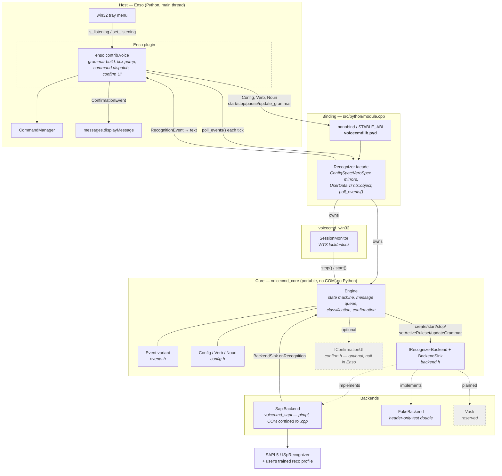

**Why `voicecmdlib` and not `voicecmd`:** an extension module shadows a same-named
`.py` in the package. The `lib` suffix keeps the native binary distinct from
`enso/contrib/voice.py` around it (same convention as `retreatlib`).

---

## 2. Threading model

Four threads, with a strict rule about who may touch what. The queue is the only
crossing point into engine state; the event list is the only crossing point out.

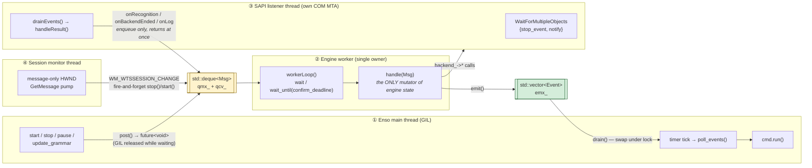

Invariants worth stating explicitly:

- Every `backend_->…` call and every mutation of `created_ / started_ /
  confirming_ / pending_` happens on ② and nowhere else.
- ③ and ④ never block on ②. The session-monitor callback drops its future on the
  floor deliberately — it comes from a `promise`, not `std::async`, so dropping
  it never blocks and never stalls the message pump.
- Push delivery (`event_sink_`) is invoked *outside* every internal lock, and a
  throwing handler is swallowed so the worker can never die on host code.
- Python callbacks fire only inside `poll_events()`, on ①, with the GIL already
  held. There is no cross-thread GIL acquisition anywhere on the hot path.

---

## 3. Engine state machine

`Config → Engine` starts the worker immediately but does **not** create the
backend. `Idle` means constructed-but-not-realized; `Stopped` retains the engine
and compiled grammars so a re-start is cheap.

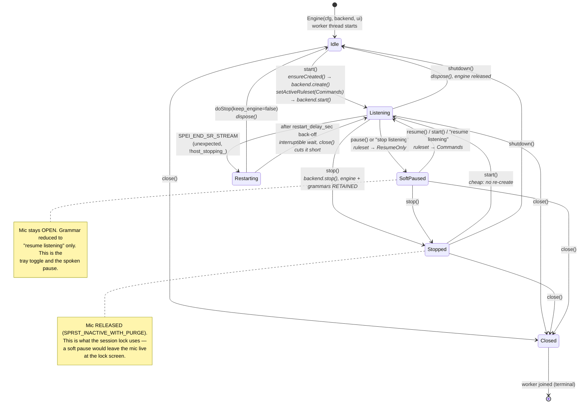

`Starting` / `Stopping` / `ShuttingDown` exist in the `State` enum as
transitional labels; the current transitions are short enough to be atomic on the
worker, so they are not dwelt in.

---

## 4. Grammar and ruleset swapping

One `ISpRecoGrammar` holds every rule. Semantic identity is read from the matched
**rule id** and from `SPPROPERTYINFO` tags — never from word positions — so
multi-word verbs, multi-word nouns and the optional keyword prefix all work
without any string slicing.

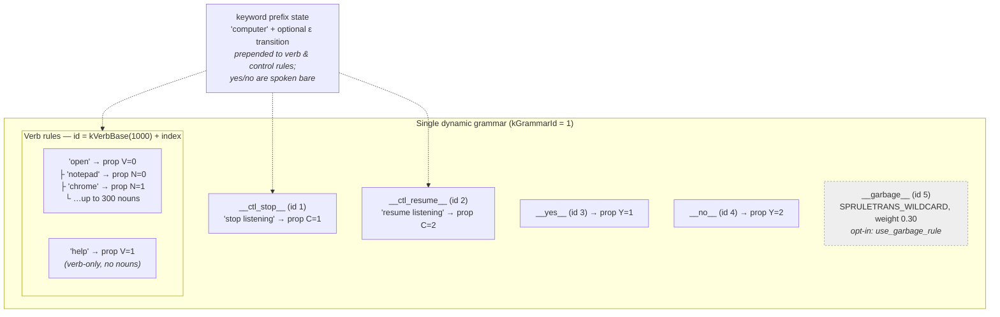

A **ruleset** is a named subset of those rules that is active at one moment.
`setActiveRuleset(r)` simply walks the rule ids and calls `SetRuleIdState` with
`SPRS_ACTIVE` or `SPRS_INACTIVE` on each — nothing is created, compiled or
destroyed, so the swap is effectively free and cannot fail halfway.

Each ruleset exists to make one class of misrecognition *structurally
impossible* rather than filtering it after the fact:

- **`Commands`** — the normal state. Verb rules are live, and so is
  `stop listening`. `resume listening` is deliberately **off**: saying it while
  already listening should do nothing, and leaving it active would let it
  compete with real commands for a match.
- **`ResumeOnly`** — the soft pause. Every verb rule is off, so a command spoken
  while paused cannot possibly be matched; the engine has nothing to match it
  *to*. Only `resume listening` remains.
- **`YesNo`** — the confirmation window. Both command and control rules are off,
  so an answer can never be misheard as a new command, and a command spoken
  during the prompt cannot queue up behind it. Only `yes` and `no` are live.

The `__garbage__` wildcard, when enabled, stays active in all three — its job is
to absorb out-of-grammar speech in whatever mode the engine is in.

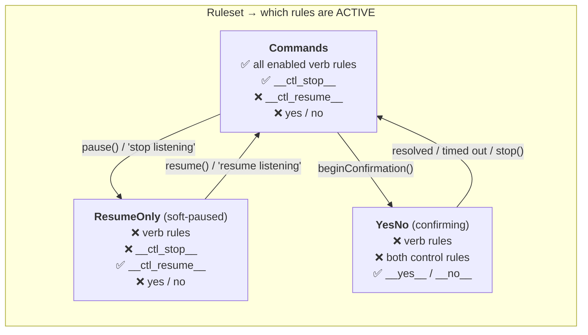

`updateGrammar()` (fired when the webui voice checkboxes change) clears the verb
rule bodies, rebuilds them, re-commits and reapplies `Commands` — the recognizer,
the context and the audio binding all survive untouched.

---

## 5. Recognition path and classification

`handleResult()` on the listener thread turns a SAPI phrase into a
`RawRecognition` — kind, verb/noun indices, resolved text, normalized confidence
— and posts it. `Engine::classify()` on the worker decides what it means.

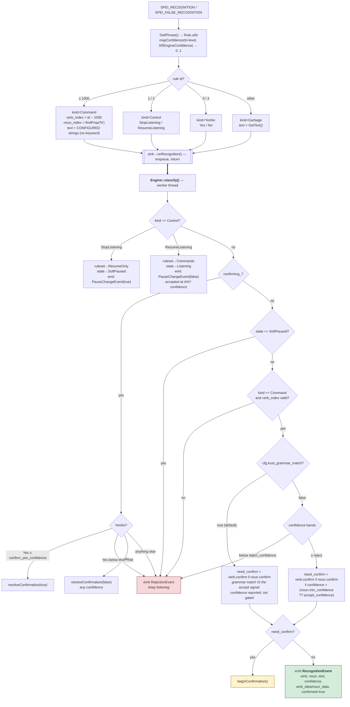

**Why `trust_grammar_match` defaults to true:** SAPI's per-recognition confidence
is unreliable for command-and-control grammars — it reports correct, fully-matched
command phrases at the same low confidence as noise. The required keyword plus the
closed grammar are the precision guard instead. Set it false for a backend with a
confidence signal worth gating on (Vosk).

**Why the in-process recognizer still gets good confidence:** `create()` explicitly
loads the default SR engine token *and the user's trained recognition profile*
(`SPCAT_RECOGNIZERS` / `SPCAT_RECOPROFILES`) into `CLSID_SpInprocRecognizer`. That
buys the calibration of the shared recognizer without launching the Windows Speech
Recognition app. `shared_recognizer=true` switches to `CLSID_SpSharedRecognizer`
if the system-wide engine is wanted instead.

---

## 6. Confirmation

Confirmation is *host-rendered*: the engine emits bracketing events and owns the
timeout; `IConfirmationUI` is optional and Enso passes null. The answer is spoken,
so there is nothing to click.

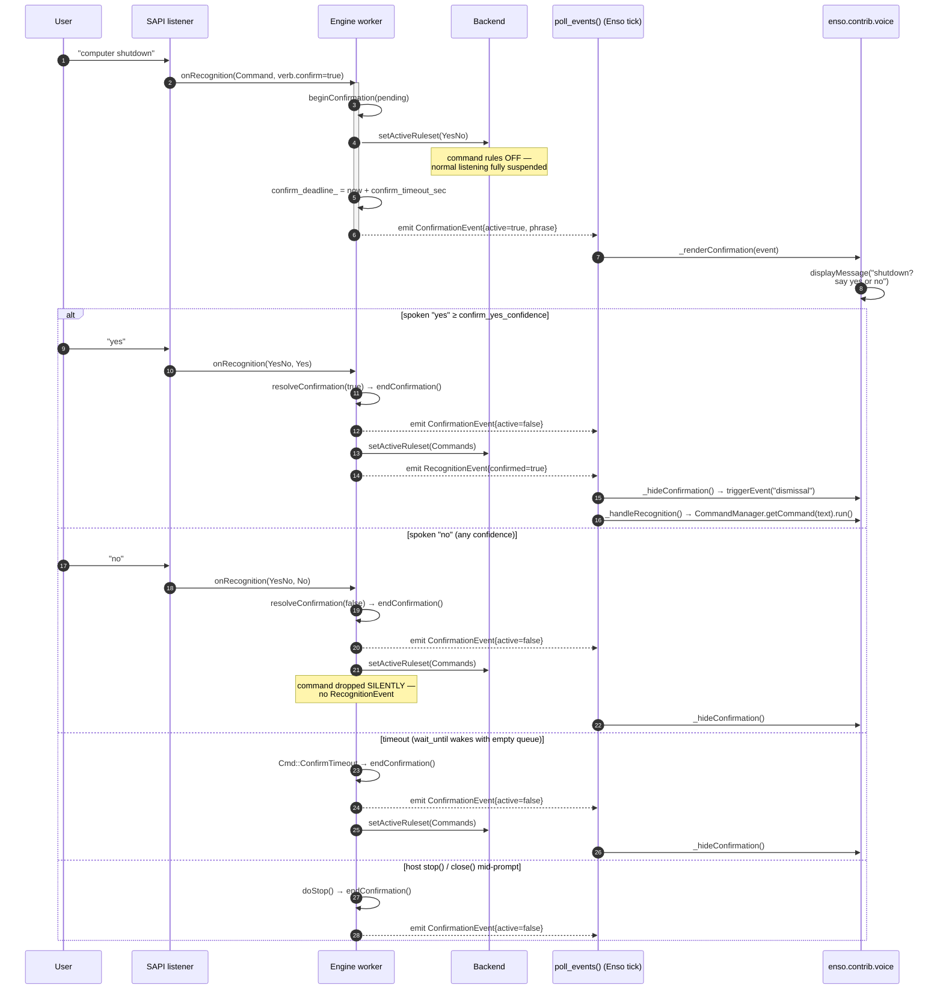

Every exit from `confirming_` funnels through `endConfirmation()` — the one place
that clears the flag, hides any attached UI and emits the closing event — so the
UI and the host-visible event can never drift apart. Enso's `_shutdown()` calls
`_hideConfirmation()` *before* checking whether the engine still exists, because a
prompt left up at exit would otherwise outlive the process that can dismiss it.

---

## 7. Session lock

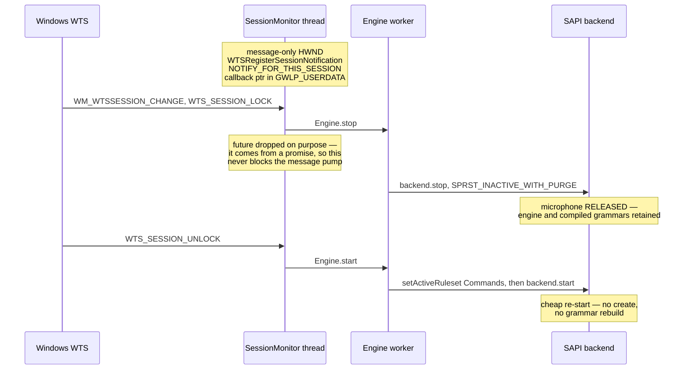

A hard `stop()` is the only correct answer here. `pause()` keeps the recognizer
and the microphone alive and leaves "resume listening" in the grammar — live to
anyone standing at the lock screen.

Teardown order matters: `monitor_` is declared *after* `eng_` so it is destroyed
first, and `close()` resets it explicitly, so a lock event arriving mid-shutdown
can never post to a dying engine. The destructor posts `WM_QUIT` to the monitor
thread and joins it.

---

## 8. Event delivery into Enso

Everything the engine wants to tell the host is one `Event` — a
`std::variant` of six alternatives — and everything goes out through a single
funnel, `Engine::emit()`. That funnel feeds two independent channels:

- **Pull (what Enso uses).** `emit()` appends to `events_` under `emx_`. The host
  calls `drain()`, which *swaps* the vector out under the lock and hands back the
  whole batch — O(1), no copying, and the engine starts accumulating into a fresh
  one immediately.
- **Push (optional).** `emit()` also invokes `event_sink_`, if one is set, on the
  worker thread — *outside* every internal lock, with a `catch (...)` around it so
  a throwing handler can never kill the worker. Enso does not set one; it exists
  for hosts that want immediate notification and are prepared to handle it on a
  foreign thread.

The pull channel is what makes commitment #2 work. `Recognizer::poll_events()`
drains, converts each variant alternative to its Python mirror via `toPy()`,
*and* fires any registered `on_*` callback — all on the caller's thread with the
GIL already held. So a recognition that arrived on the SAPI listener thread at
some arbitrary moment does not touch Python until Enso's `"timer"` responder
picks it up, and `cmd.run()` then executes on the same thread as a
keyboard-triggered command. No cross-thread GIL acquisition happens anywhere on
this path.

Two consequences of the buffer sitting between the threads. **Latency** is
bounded by the tick interval, not by recognition — the engine never waits on the
host. **Ordering is FIFO and load-bearing**: `resolveConfirmation()` emits the
closing `ConfirmationEvent` *before* the `RecognitionEvent`, so within a single
`poll_events()` batch Enso is guaranteed to retract the prompt before it runs the
command it was asking about. The queue is unbounded, so a host that stops polling
accumulates rather than drops — acceptable here because the only consumer is a
tick that runs as long as Enso is alive.

On the Python side `_onTick` is a flat `isinstance` dispatch over the batch, with
one piece of work ahead of it: if `config.VOICE_COMMANDS_CHANGED` is set (the
webui toggled a voice checkbox), the grammar is rebuilt and pushed down before
the batch is drained.

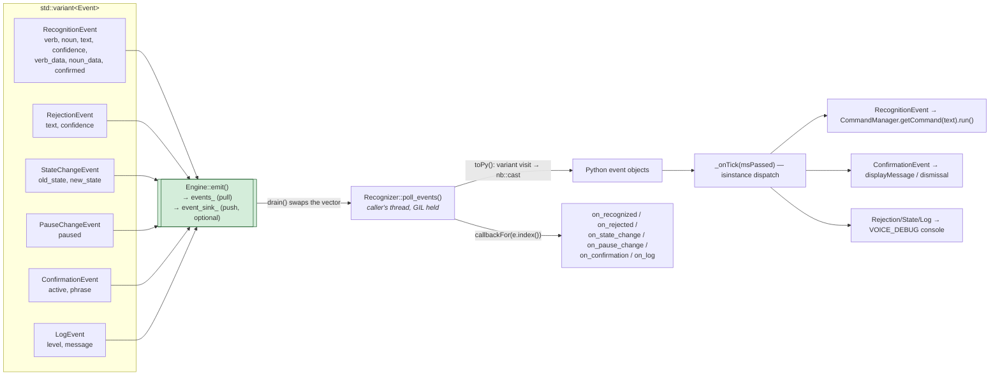

Two details that are load-bearing:

- **`callbackFor()` resolves the variant index at compile time**
  (`variantIndex<T, Event>()`), not from hard-coded ordinals. Inserting a new
  alternative into `Event` therefore cannot silently reroute callbacks to the
  wrong handler.
- **`UserData` is a `shared_ptr<void>` whose deleter re-acquires the GIL**, since
  a grammar replacement can drop the last reference to a Python object on the
  worker thread. The core never inspects the payload; Enso stores the original
  command expression there and gets it back on every event.
- **`_onTick` catches everything.** `EventManager.onTick()` has no exception
  handling of its own, so an escape would propagate through the native
  `InputManager` callback and take down the whole Enso event loop.

---

## 9. Host integration (Enso)

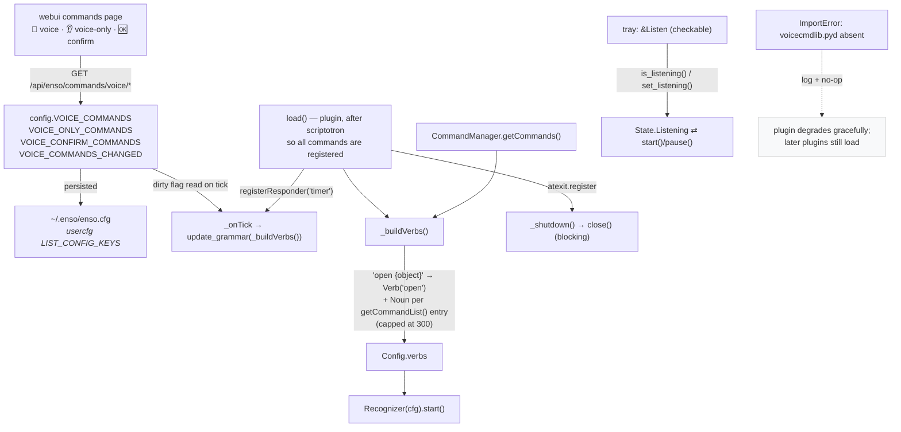

`set_listening(True)` calls `start()` rather than `resume()` on purpose:
`resume()` only lifts a soft pause, while `start()` also covers the engine having
been stopped outright — which is exactly what the session lock does.

The `.pyd` is an optional install component (NSIS `Section /o "Voice Recognition"`),
so its absence must be survivable: `voice.py` imports it defensively and no-ops,
because `plugins.py` logs *and re-raises*, which would otherwise abort every
plugin queued after it.

---

## 10. Build

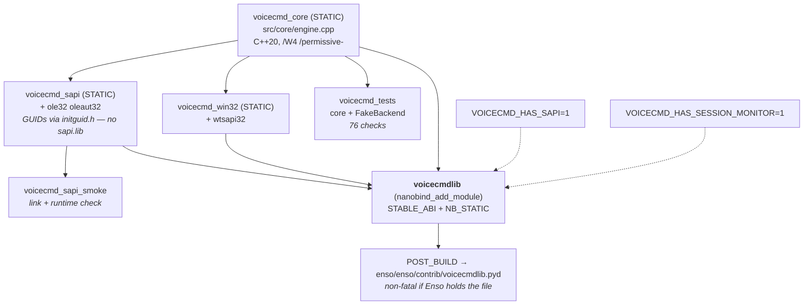

`build.ps1` is machine-independent by construction: Visual Studio and its bundled
CMake are located with **vswhere**; the target interpreter is Enso's own bundled
Python found *relative to the script*, passed as `-DPython_ROOT_DIR` (an embedded
distribution has no registry entry, so `find_package(Python)` cannot locate it
otherwise); and nanobind — a build-time source dependency — is probed across
candidate interpreters and otherwise auto-provisioned at a pinned version into
`build-msvc\.tools`.

```
.\build.ps1              # incremental build + deploy
.\build.ps1 -Configure   # re-run cmake configure (after CMakeLists edits)
.\build.ps1 -StopEnso    # close a running Enso so the .pyd isn't locked
.\build.ps1 -Tests       # build and run the core unit tests
```

**nanobind, not pybind11:** pybind11 under `Py_LIMITED_API` triggers an internal
compiler error on MSVC 14.44. Note that abi3 is *forward*-compatible only — the
binary is built against Enso's bundled 3.14 headers and is not loadable on an
older interpreter, which is fine given it only ever loads inside Enso.

---

## 11. Testing

`FakeBackend` is a header-only `IRecognizerBackend` with atomic counters and a
`feed()` / `endUnexpectedly()` interface, standing in for the SAPI callback
thread. It needs no audio, no COM and no host, so the entire state machine —
lifecycle transitions, ruleset swaps, classification bands, confirmation
begin/resolve/timeout/stop, and unexpected-end auto-recovery — is exercised
deterministically by `voicecmd_tests`. `Engine::sync()` provides the FIFO barrier
that makes those assertions race-free: it resolves only once every message queued
before it has been handled.
