# voicecmd — voice recognition architecture

*Audience: an engineer picking this subsystem up for the first time.*

---

## 1. The mental model

Enso normally takes commands from the keyboard. `voicecmd` adds a second input
path for the same commands. The thing to understand before anything else is that
**this is mostly not speech-to-text.** The system is handed a closed list of
phrases — built from exactly those Enso commands you ticked in the webui — and
that list is what it recognizes. Say something not on it and there is nothing to
match against. (The one deliberate exception is §4.11: a command whose argument
cannot be enumerated gets a dictated tail, which *is* free transcription. It is
opt-in per command and costs precision, which is why it is the exception rather
than the model.) Nearly every design decision below falls out of
that single choice: because the list is closed, a match is trustworthy enough to
act on without second-guessing the confidence score; because the list changes
whenever you tick a checkbox, it has to be rebuildable while running; and because
Windows delivers recognitions on its own threads while Enso commands must run on
Enso's thread, there is a queue in the middle doing the handover.

**Vocabulary used throughout.** A **verb** is a command's leading words
(`open`). A **noun** is one concrete argument for it (`notepad`). Together they
form a **phrase** the user can say. A **grammar** is the whole set of phrases the
recognizer will accept. A **ruleset** is the subset of the grammar that is
switched on right now.

---

## 2. System map

Five components, bottom to top. Each depends only on the one below it.

| Component | CMake target | One-line purpose |
|---|---|---|
| **Backend** | `voicecmd_sapi`, `FakeBackend` | Talks to the actual speech engine. Turns "the user said something" into a structured `RawRecognition`. All COM lives here. |
| **Core** | `voicecmd_core` | The `Engine`. Decides what a recognition *means* and what state the system is in. Portable — no COM, no Python. |
| **Platform** | `voicecmd_win32` | `SessionMonitor` — tells the engine when the workstation locks. |
| **Binding** | `voicecmdlib` (nanobind) | Makes the core importable from Python and converts types across the boundary. The only component that touches CPython. |
| **Host** | `enso.contrib.voice` | The Enso plugin. Builds the grammar from Enso's commands, pumps events, runs the recognized command. |

Two seams matter more than the rest. `IRecognizerBackend` / `BackendSink`
(`backend.h`) is where a speech engine plugs in — SAPI today, Vosk reserved, a
fake one for tests. `Recognizer` (`module.cpp`) is where C++ becomes Python.

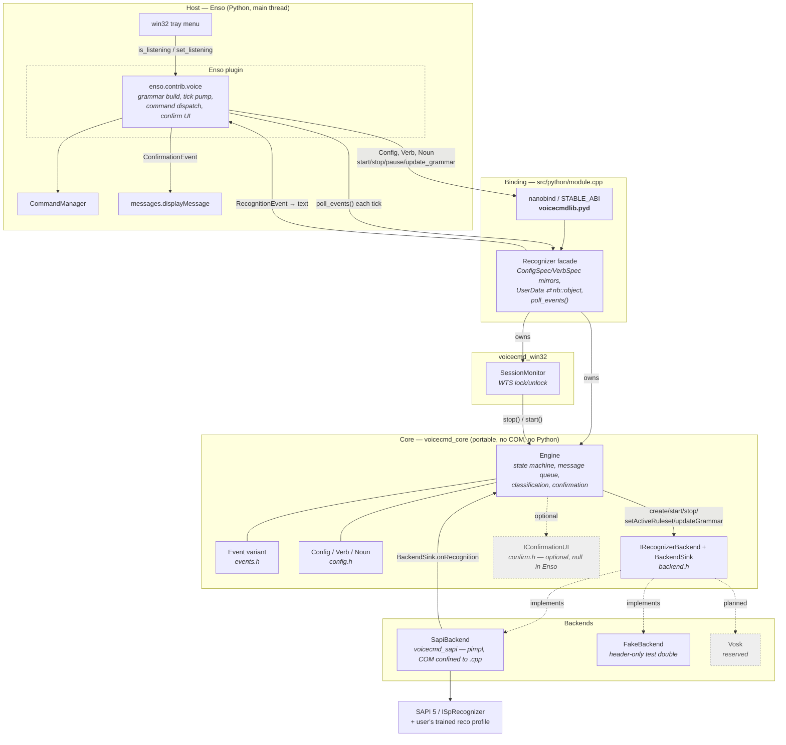

**A naming trap.** Four similar names, deliberately distinct:
`VoiceCmd/` (this directory), `voicecmd` (the C++ namespace), `voicecmdlib.pyd`
(the built binary), `enso/contrib/voice.py` (the Enso plugin). The binary is
*not* called `voicecmd.pyd` because an extension module shadows a same-named
`.py` in the same package — the `lib` suffix keeps them apart. Confirmed by the
comment at `CMakeLists.txt:76-81`; same convention as `retreatlib`.

---

## 3. A representative flow

Follow one utterance — *"computer open notepad"* — from microphone to the Notepad launch.
It crosses three threads, and where those boundaries fall is the whole story.

### 3.1 The threads

Four, with a strict rule about who may touch what. The **command queue** is the
only way into engine state; the **event buffer** is the only way out.

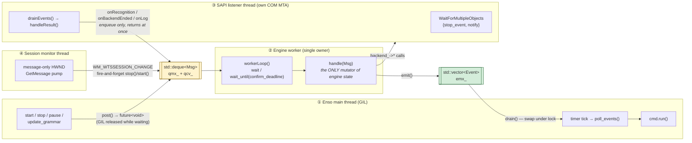

Invariants (confirmed by the header comment at `engine.cpp:3-6`):

- Every `backend_->…` call and every mutation of `created_ / started_ /
  confirming_ / pending_` happens on ② and nowhere else.
- ③ and ④ never block on ②. The session-monitor callback drops its future
  deliberately — it comes from a `promise`, not `std::async`, so dropping it
  never blocks and never stalls the message pump.
- Python callbacks fire only inside `poll_events()`, on ①, with the GIL already
  held. Nothing acquires the GIL from a foreign thread.

### 3.2 Step 1 — the backend hears something (thread ③)

SAPI signals its notify handle. `SapiBackend::Impl::drainEvents()`
(`sapi_backend.cpp:285`) pulls the event and `handleResult()` (`:319`) turns it
into a `RawRecognition`.

The important trick: **identity comes from the matched rule id, never from word
positions.** The grammar assigned `open` rule id `1000 + index`, and tagged the
noun with an `SPPROPERTYINFO` named `N`. So `handleResult` reads
`phrase->Rule.ulId` to get the verb and `findProp(…, L"N")` to get the noun.
Multi-word verbs, multi-word nouns and the optional `computer` prefix all work
without slicing a single string.

It also rebuilds `r.text` from the *configured* strings rather than what the
recognizer transcribed — so the host receives exactly `"open notepad"`, keyword
stripped, in the original casing, ready to hand to `CommandManager`.

Then it calls `sink->onRecognition(...)`, which only enqueues and returns.

### 3.3 Step 2 — the core decides what it means (thread ②)

`Engine::classify()` (`engine.cpp:339`) runs the decision tree below. Control
phrases are checked first, then confirmation state, then pause state, then the
command itself.

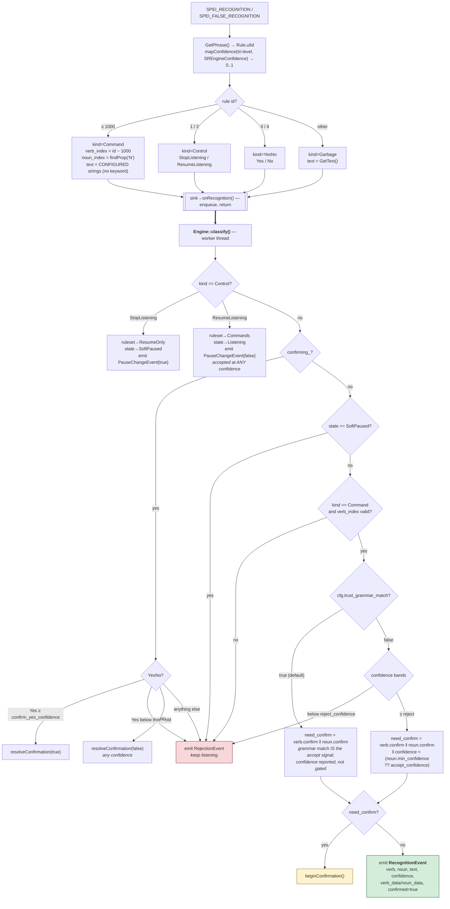

For our utterance: not control, not confirming, not paused, valid command,
`trust_grammar_match` is on and neither verb nor noun demands confirmation — so
`emit(RecognitionEvent{...})`. The worker moves to its next message immediately.
Nothing has been delivered anywhere yet.

### 3.4 Step 3 — the event waits

`emit()` (`engine.cpp:109`) appends to `events_` under `emx_`. That is the whole
step. The event now sits in C++ memory until the host comes to collect it.

This parking is what buys the guarantee in §4.2 — nothing has touched Python yet.

### 3.5 Step 4 — Enso collects and runs it (thread ①)

Milliseconds later Enso's main loop fires `_onTick(msPassed)` (`voice.py:262`),
which calls `poll_events()` (`module.cpp:258`). That:

1. calls `drain()`, which **swaps** the buffer out under the lock and returns the
   whole batch — O(1), nothing copied, and the worker immediately starts filling
   a fresh one;
2. converts each variant alternative to its Python mirror via `toPy()`;
3. fires any registered `on_*` callback;
4. returns the list.

`_onTick` does a flat `isinstance` dispatch, reaches `_handleRecognition`
(`voice.py:337`), and calls `CommandManager.get().getCommand("open notepad").run()`
— on the main thread, exactly as if you had typed it.

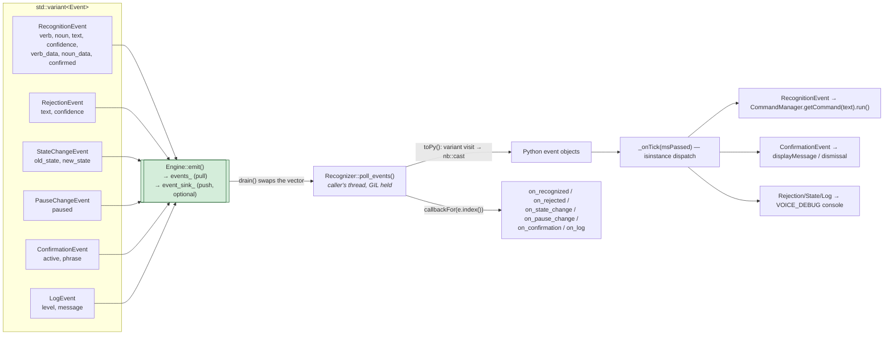

Three properties of the buffer, worth knowing before you debug it:

- **Latency** is bounded by the tick interval, not by recognition. The engine
  never blocks on the host.
- **Ordering is FIFO and load-bearing.** `resolveConfirmation()` emits the
  closing `ConfirmationEvent` *before* the `RecognitionEvent`, so within one
  batch Enso always retracts the prompt before running the command it asked
  about. *(Inferred from the emit order at `engine.cpp:458-480`; no comment
  states the host-facing consequence.)*
- **The buffer is unbounded.** A host that stops polling accumulates rather than
  drops. Acceptable because the only consumer runs as long as Enso does.

There is also an optional **push** channel, `event_sink_`, called directly on the
worker thread. Enso does not set one. It exists for hosts that want immediate
notification and can cope with a foreign thread.

### 3.6 What else `_onTick` does

Before draining, it checks `config.VOICE_COMMANDS_CHANGED`. If the webui toggled
a voice checkbox, the grammar is rebuilt from scratch and pushed down first.

---

## 4. Design decisions and why

### 4.1 Single owner: one thread mutates everything

All lifecycle transitions are messages on one queue consumed by one worker
thread. Control methods return `std::future<void>`, so a caller can block, wait
with a timeout, or ignore the result.

The rationale is stated at `engine.cpp:3-6`: backend callbacks and the
confirmation UI *only post* — they never mutate engine state inline. The payoff
is that there are no lock-ordering questions anywhere in the core, and the state
machine can be tested with no threads racing it.

**Exception propagation comes free with this.** `handle()` (`engine.cpp:196-205`)
wraps every transition in try/catch and forwards a failure via
`promise::set_exception`. `Recognizer::await()` (`module.cpp:318`) then calls
`fut.get()` with the GIL held, so a C++ handler failure surfaces in Python as a
normal exception rather than a silent no-op.

`Engine::sync()` is the same mechanism used as a barrier: it resolves only once
every message queued before it has been handled. That is what makes the tests
deterministic, and it is available to any caller.

### 4.2 Pull-mode delivery: native threads never call Python

Stated at `module.cpp:13-16`. Events are parked in C++ and collected on Enso's
tick. The alternative — calling into Python from the SAPI listener thread —
would mean acquiring the GIL from a foreign thread and running Enso commands
off-main-thread.

**Tradeoff:** latency is bounded by the tick interval rather than being
immediate. For a voice command that is imperceptible, and it buys the single
most valuable property in the design: a voice-triggered command and a
keyboard-triggered command run on the same thread, through the same code, with
no concurrency difference between them.

### 4.3 One engine, swapped rulesets

There is exactly one recognizer and one grammar. Every phrase the user can say —
each enabled command, both pause-control phrases, and yes/no — is a top-level
rule in it. Rationale at `sapi_backend.cpp:3-8`.

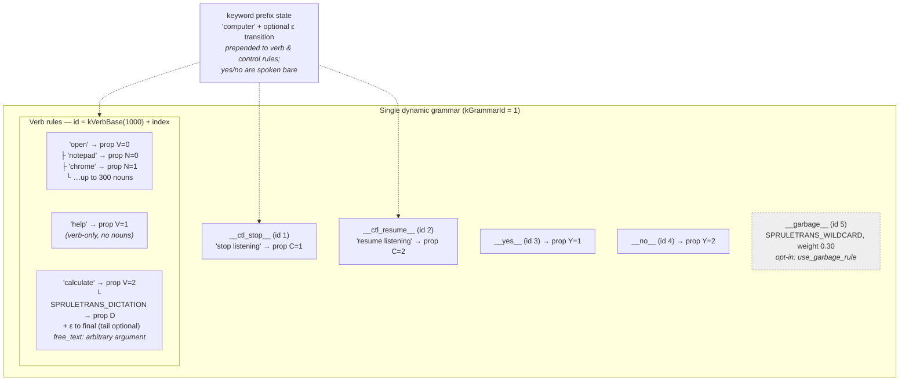

A **ruleset** is which of those rules are switched on right now.
`setActiveRuleset(r)` walks the rule ids calling `SetRuleIdState` — nothing is
created, compiled or destroyed, so the swap is effectively free and cannot fail
halfway.

Each ruleset makes one class of misrecognition *structurally impossible* rather
than filtering it afterwards:

- **`Commands`** — normal listening. Verb rules live, plus `stop listening`.
  `resume listening` is deliberately off so it cannot compete with real commands.
- **`ResumeOnly`** — soft-paused. Every verb rule off, so a command spoken while
  paused cannot be matched — there is nothing to match it *to*.
- **`YesNo`** — confirmation window. Commands and control both off, so an answer
  can never be misheard as a command, nor a command queue up behind the prompt.

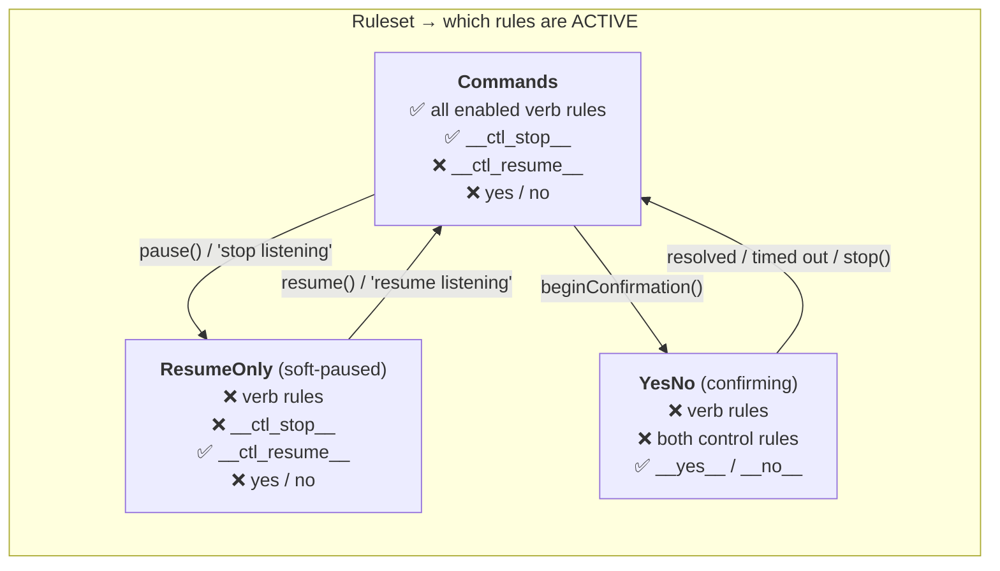

**The spoken control phrases, verbatim:**

- **"computer stop listening"** — suspends command recognition; mic stays open.
- **"computer resume listening"** — the only phrase live while paused, accepted
  at any confidence so a paused engine is always recoverable.

Both take the keyword prefix (`computer` by default, optional when
`keyword_required` is false). **"yes"** and **"no"** are spoken bare — they are
only ever live inside a confirmation window, so a prefix would be noise.

The `__garbage__` wildcard, when enabled, stays active in all three. It is **off
by default**: `config.h:71-75` records that in practice it over-matches and wins
against real command rules, and SAPI already rejects out-of-vocabulary speech via
`SPEI_FALSE_RECOGNITION`.

`updateGrammar()` clears the verb rule bodies, rebuilds, re-commits and reapplies
`Commands`. The recognizer, context and audio binding all survive untouched.

### 4.4 Trust the grammar match, not the confidence score

`config.h:85-92` states it plainly: SAPI's per-recognition confidence is
unreliable for command-and-control grammars — it reports correct, fully-matched
command phrases at the same low confidence as noise. So `trust_grammar_match`
defaults to **true**, and a grammar match is the accept signal. The required
keyword plus the closed grammar are the precision guard instead.

**Tradeoff, and it is a real one:** maximum recall, at the cost of accepting
whatever SAPI force-matches onto a command rule. Set it false for a backend whose
confidence means something (Vosk) to get three-band gating instead. See §5.2 —
this default silently disables several config knobs.

Relatedly, `create()` (`sapi_backend.cpp:413-430`) explicitly loads the default
SR engine token *and the user's trained recognition profile* into
`CLSID_SpInprocRecognizer`. That buys the shared recognizer's calibration
**without launching the Windows Speech Recognition window** — which was the
original motivation for going in-process at all.

### 4.5 Lifecycle: four verbs with different retention

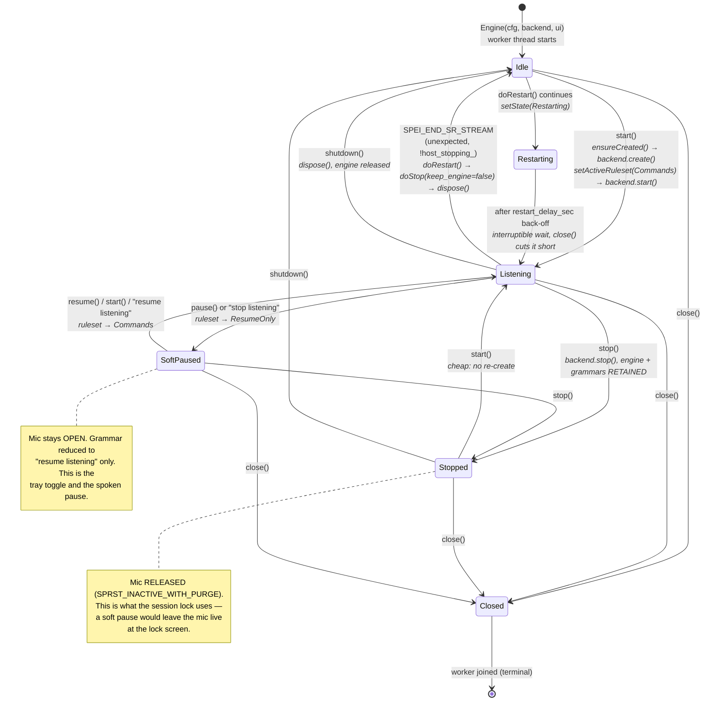

`Idle` means constructed-but-not-realized: the worker thread is running, but the
backend has not been created. `Stopped` retains the engine and compiled grammars,
so restarting is cheap. See §5.1 for the four teardown verbs, which are the most
commonly confused part of this diagram.

**Auto-recovery.** If SAPI ends the stream unexpectedly, the engine restarts
itself. The `host_stopping_` flag (`engine.cpp:254`) is what distinguishes
"the audio device died" from "the host asked us to stop" — without it, every
deliberate `stop()` would trigger a spurious restart. The back-off before
re-starting is an interruptible timed wait, so `close()` cuts it short rather
than making shutdown wait out the delay.

**[inferred]** `Starting`, `Stopping` and `ShuttingDown` exist in the `State`
enum but are never passed to `setState()`. The transitions are short enough to be
atomic on the worker, so these states are never observed. Treat them as reserved.

### 4.6 Confirmation is host-rendered

The engine emits bracketing events and owns the timeout. `IConfirmationUI` is
optional and Enso passes null — the answer is spoken, so there is nothing to
click. `events.h:57-61` confirms the intent: emitted regardless of whether a UI
is attached, so a host drawing its own prompt needs no in-library dialog.

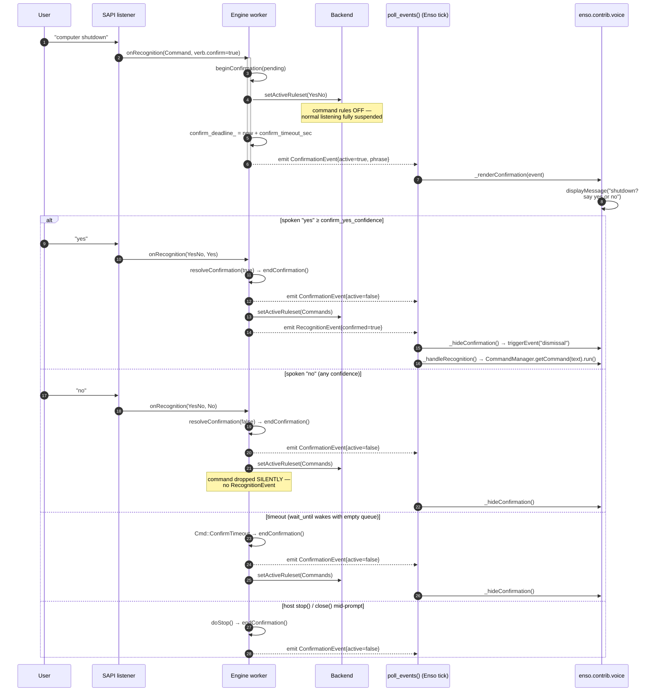

Note the four exits, and that **all of them funnel through `endConfirmation()`**
(`engine.h:105-108`) — the one place that clears the flag, hides any attached UI
and emits the closing event. That is why the UI and the host-visible event cannot
drift apart.

The timeout is implemented without a timer thread: `workerLoop()` uses
`wait_until(confirm_deadline_)` instead of `wait()` while confirming, so an empty
wakeup *is* the timeout.

On the Enso side, `_shutdown()` calls `_hideConfirmation()` *before* checking
whether the engine still exists — a prompt left up at exit would otherwise
outlive the process that could dismiss it.

### 4.7 Session lock is a hard stop, not a pause

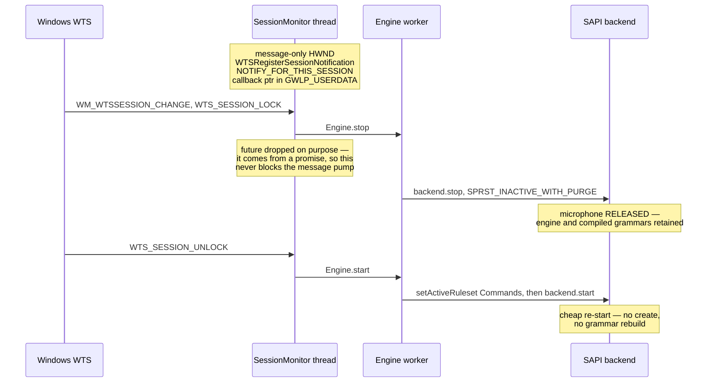

`module.cpp:293-300` spells out why `pause()` would be wrong: it keeps the
recognizer and the microphone alive and leaves `resume listening` in the grammar
— live to anyone standing at the lock screen. `stop()` releases the audio device
while retaining the compiled grammars, so unlocking is cheap.

Teardown order is deliberate: `monitor_` is declared *after* `eng_` so it is
destroyed first, and `close()` resets it explicitly, so a lock event arriving
mid-shutdown cannot post to a dying engine.

### 4.8 The host filters the grammar, not the library

`voice.py::_buildVerbs` only includes commands present in
`config.VOICE_COMMANDS`. A parameterized command (`open {object}`) becomes a verb
plus one noun per concrete argument enumerated from its factory; commands that
accept arbitrary arguments enumerate nothing; `_buildVerbs` reads that empty
list as "needs dictation" and sets `free_text` on the verb instead (§4.11).
Nouns are capped at `_MAX_NOUNS_PER_VERB = 300` so a factory with a huge learned
list cannot balloon the grammar.

Note the redundancy: `Verb::disabled` exists in `config.h` and is honored by the
backend, but `voice.py` never sets it — filtering happens host-side instead. Both
mechanisms work; only one is used.

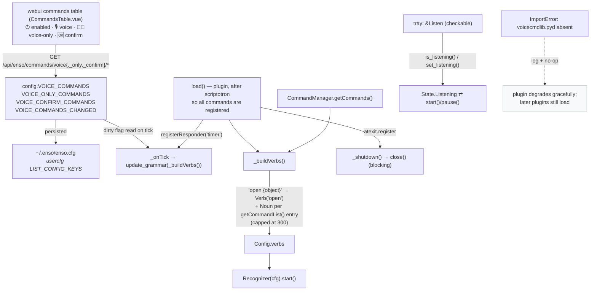

**The three voice checkboxes are independent.** They live in
`webui-src/src/components/CommandsTable.vue`, rendered only when the native
module is installed (`v-if="voiceAvailable"`), to the right of the always-present
⏻ enabled column:

| Checkbox | Config list | Effect |
|---|---|---|
| 🎙️ voice | `VOICE_COMMANDS` | Command joins the voice grammar. |
| 👂🏻 voice-only | `VOICE_ONLY_COMMANDS` | Command is *hidden from the typed quasimode UI* — five checks in `commands/factories.py` suppress it from suggestions while leaving it resolvable. |
| 🆗 confirm | `VOICE_CONFIRM_COMMANDS` | Sets `Verb.confirm`, so it needs a spoken "yes". Its header carries the `?` link to the tutorial's voice section. |

Route names are centralized in `webui-src/src/api/types.ts`
(`commands/voice`, `commands/voice_only`, `commands/voice_confirm`).

**Two switches gate the plugin entirely.** `config.VOICE_ENABLED` (default
`True`) — `load()` returns immediately if false, and the native module is never
started. And the import itself: the `.pyd` is an optional install component
(NSIS `Section /o "Voice Recognition"`), so `voice.py` imports it defensively and
no-ops on `ImportError`. That matters because `plugins.py` logs *and re-raises*,
which would otherwise abort every plugin queued after this one.

`set_listening(True)` calls `start()` rather than `resume()` on purpose:
`resume()` only lifts a soft pause, while `start()` also covers the engine having
been stopped outright — which is what the session lock does.

**Note:** `config.VOICE_DEBUG` currently defaults to `True`, so rejection,
state-change and raw-confidence diagnostics print to the console out of the box.
That is a bring-up default, not a permanent one.

### 4.9 nanobind and the abi3 build

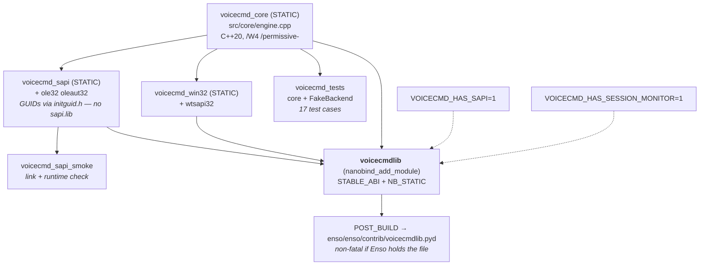

nanobind rather than pybind11 because pybind11 under `Py_LIMITED_API` triggers an
internal compiler error on MSVC 14.44 (`CMakeLists.txt:61-67`).

**On abi3, precisely:** `STABLE_ABI` is *forward*-compatible only. `Py_LIMITED_API`
sets an API floor, but the binary is built against the headers of whichever
interpreter CMake resolved — Enso's bundled Python — and will not load on an older
one. It doesn't matter in practice: the `.pyd` only ever loads inside Enso's own
interpreter. The header comment at `module.cpp:1-8` says the same.

`build.ps1` is machine-independent by construction: Visual Studio and its bundled
CMake are located with **vswhere**; the target interpreter is Enso's own bundled
Python found relative to the script and passed as `-DPython_ROOT_DIR` (an
embedded distribution has no registry entry, so `find_package(Python)` cannot
find it otherwise); and nanobind is probed across candidate interpreters and
auto-provisioned at a pinned version if absent.

```
.\build.ps1              # incremental build + deploy
.\build.ps1 -Configure   # re-run cmake configure (after CMakeLists edits)
.\build.ps1 -StopEnso    # close a running Enso so the .pyd isn't locked
.\build.ps1 -Tests       # build and run the core unit tests
```

### 4.10 Testability

`FakeBackend` is a header-only `IRecognizerBackend` with atomic counters and a
`feed()` / `endUnexpectedly()` interface, standing in for the SAPI callback
thread. No audio, no COM, no host. Because the core is COM-free and Python-free,
the entire state machine — lifecycle transitions, ruleset swaps, confidence
bands, confirmation begin/resolve/timeout/stop, and unexpected-end auto-recovery
— runs deterministically in a plain console executable.

`Engine::sync()` is what makes the assertions race-free.

### 4.11 Dictated tails for arbitrary arguments

Some commands take a parameter that cannot be listed in advance — `calculate
{expression}` is the canonical case. Enso registers these as `arbitrary-arg`
(`cmdretriever.py:73`), and their factory (`ArbitraryPostfixFactory`) enumerates
nothing, so `getCommandList()` returns an empty list.

Left alone, such a command produces a **verb-only** grammar rule. Saying
"computer calculate 2+2" then matches only `computer calculate`; the "2+2" is
out-of-grammar audio and is discarded, the host receives the text `"calculate"`,
and the command runs with no argument at all. That is a confusing failure, not a
useful one.

So a verb may set `free_text`, which changes its rule in two ways
(`sapi_backend.cpp::buildVerbRule`):

1. a `SPRULETRANS_DICTATION` transition after the verb, tagged with property
   `D`, backed by `LoadDictation` (loaded lazily, once, only if some verb needs
   it);
2. an **epsilon transition to final**, which keeps the tail *optional*.

Step 2 matters: `calculate` falls back to the current selection when given no
argument (`calc.py:41-44`), so "computer calculate" with text selected has to
keep working. Making dictation mandatory would have broken it.

`handleResult` recovers the dictated words by reading the `D` property's
`ulFirstElement` / `ulCountOfElements` and asking `GetText` for exactly that
range — not the whole utterance, which would still contain the keyword and verb.

**The transcription is passed through verbatim and is not normalized.** Say
"computer calculate two plus two" and the host receives exactly
`calculate two plus two`. Enso's calculator will reject that, because it wants
`2+2`. Mapping spoken math onto operators is a host concern and is deliberately
not attempted here.

**The tradeoff is real and is why this is opt-in per verb.** A dictation
transition matches almost any audio, so every free-text verb weakens the
precision guard that §4.4 leans on. `kDictationWeight` (0.50) keeps it below the
fixed rules so an enumerated noun always wins on the same verb, but it does not
eliminate the effect. Only commands that genuinely cannot enumerate should set
it — which is exactly what `_buildVerbs` does, and nothing else.

---

## 5. Where it gets confusing

### 5.1 Four teardown verbs that are not synonyms

The single most common source of confusion. They differ in *what survives*:

| Call | Mic | Backend engine + grammars | Worker thread | Getting back |
|---|---|---|---|---|
| `pause()` | **open** | kept | running | `resume()` / `start()` — instant |
| `stop()` | released | **kept** | running | `start()` — cheap, no rebuild |
| `shutdown()` | released | **disposed** | running | `start()` — full re-create |
| `close()` | released | disposed | **joined; terminal** | never — construct a new one |

`pause()` is a *grammar* change, not an audio change — that is why it is wrong
for the lock screen (§4.7). `close()` is the only irreversible one, and it must
never be called from the worker thread itself.

### 5.2 Grammar membership is decided in two places

Whether a command is in the voice grammar can be controlled from either end, and
only one end is actually wired up:

- **Host-side filter (used).** `voice.py::_buildVerbs` skips any command not in
  `config.VOICE_COMMANDS`, so unticked commands never become a `Verb` at all.
- **`Verb::disabled` (not used).** The field exists in `config.h:44` and is
  honored by the backend — `sapi_backend.cpp:236` skips disabled verbs when
  building rules, `:259` skips them when activating. But `_buildVerbs` never
  sets it.

Both work. If you are debugging "why is this command not recognized", check
`VOICE_COMMANDS` first — `disabled` will always be `false`. **[inferred** from
cross-referencing the two files; no comment marks either as canonical.**]**

The same split exists one level up: `VOICE_COMMANDS` controls the *grammar*,
while `VOICE_ONLY_COMMANDS` controls the *typed* UI. A command can be in one,
both, or neither, and the two are independent (§4.8).
