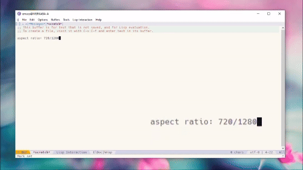

## Enso Launcher (Open-Source)

A feature-rich descendant of Enso Community Edition (Microsoft Windows/Linux/MacOS). 

#### History

At first there was a proprietary closed-source Enso Launcher from [Humanized](https://web.archive.org/web/20140701081042/http://humanized.com/). 
This version was extensible by many programming languages, but one day it went 
open ([Enso Community Edition](https://web.archive.org/web/20110128205130/http://www.ensowiki.com/wiki/index.php?title=Main_Page)) and became extensible only in Python. 
By some reasons it has also ceased.

At the moment [Enso Open-Source](https://gchristensen.github.io/enso-portable/) is the most feature-rich descendant of 
Enso Community Edition. 


#### What is Enso

Enso is a command-line launcher that lives on top of whatever else you're doing, rather than in
its own window. A single key (CapsLock) brings up a small, unobtrusive command line anywhere on the screen;
typing begins filtering a list of short, memorable commands (`open notepad`, `google quark`, `define serendipity`) as you go, with the best match and its effect shown immediately so
you can see what will happen before committing to it. Releasing the Caps key or pressing return runs the
command and the interface disappears again.
Commands are plain Python functions, so the set of things Enso understands is meant to be extended
by anyone who can write one.

A handful of built-in commands cover most of what people reach for a mouse
to do. `open` launches applications, documents, and folders by name, and can
be taught new names for anything you open often. Window commands
(`maximize`, `minimize`, `close`, and friends) act on whatever window
currently has focus, while `go` switches focus to another open window by
typing a fragment of its title, no alt-tabbing required. Commands that take
a selection, like `calculate`, act on whatever text is currently highlighted
and can paste the result back in its place. Media commands (`play`,
`pause`, `next track`, `volume up`) drive whatever player you have running.
`google`, `wikipedia`, `youtube`, and similar commands turn the rest of your
typing into a search, opened directly in the browser. And session commands
(`shut down`, `reboot`, `log off`, `suspend`, `hibernate`) reach the
operating system itself without a Start menu in sight.

It looks like this:




#### Modal vs. quasimodal

The original Enso, in the spirit of Jeff Raskin, was strictly *quasimodal*: the
quasimode (command line) stayed active only while a key was physically held
down (e.g. Caps Lock), and closed the instant it was released, the same way a
Shift key only capitalizes letters while held. This was a deliberate
consequence of Raskin's humane interface philosophy: modes are a source of
user error because the interface behaves differently depending on invisible
state the user must remember, and a mode the user must actively sustain by
holding a key can never be forgotten about, since letting go always returns
you to the base state.

Speed was the other half of Raskin's argument for building Enso this way. In
*The Humane Interface* he pointed out that using a mouse means visually
hunting for a target and then guiding the pointer onto it, an action
governed by Fitts's Law: the smaller and farther the target, the longer the
movement takes, and reaching for the mouse in the first place breaks the
cadence a touch typist has already built up on the keyboard. Switching
between windows is a familiar case of this cost - clicking a taskbar entry
or an icon buried in another window means locating it on screen first -
and so is working with a text selection, where you must aim the pointer at
one edge, drag it to the other while the target keeps changing size, and
only then can you invoke whatever should act on it. Naming a command by
typing a few letters of a memorable word skips the hunting and pointing
entirely - recall of a word is close to instantaneous, the keystrokes are
the same practiced motion as everything else the hands are doing, and the
quasimode's incremental matching lets you stop typing the moment the
intended command is unambiguous. Enso applies this directly: switching to
another window or acting on the current text selection are themselves
quasimode commands, reachable without the hands ever leaving the keyboard.

For convenience, Enso Open-Source instead defaults to a *modal* quasimode: tapping the
activation key toggles the command line open, and it stays open (is "sticky")
until a command is run or it is dismissed explicitly, rather than requiring
the key to be held down. This default can be reverted to Raskin's original
quasimodal behavior by setting the `IS_QUASIMODE_MODAL` configuration
variable to `False` in `ensorc.py` (available in the settings UI).

The speed of the [quasimodal approach](https://youtu.be/o_TlE_U_X3c?t=22), however, does not come naturally to anyone used to mainstream computer interaction.
You have to train yourself into the habit.


#### Additional features not found in the original Enso

* Python 3 support.
* Option pages with a built-in command editor.
* Ability to disable commands.
* It is possible to execute user-supplied code in a separate thread on Enso start (useful for scheduling).
* Mediaprobes (templates for automatic command generation from file-system).
* Ability to restart using tray menu or 'enso restart' command.
* Enso Retreat - a break reminder utility.
* Voice-based command execution.

#### Known issues

* The trigger key will not show the command line if any privileged (adminstrator) process is under the focus (use the 'capslock toggle' command to flip CAPSLOCK state 
  if it's wrong). This problem could be mitigated by digitally signing the
  bundled Python binary. See the section below for details
* Some security tools may consider run-enso.exe as a potentially unwanted program.  
  These are false-positive claims, since the launcher uses API needed to run other programs.


#### Digitally signing Python binary to make Enso work properly with elevated processes

TL;DR

1. Install into `C:\Program Files\Enso Launcher`.
2. Execute Run [`tools/sign-uiaccess.ps1`](tools/sign-uiaccess.ps1) from an **elevated** PowerShell prompt.

Because Enso has no traditional input components, it needs Windows **UIAccess** to receive input while an
elevated process is in the foreground (e.g. Windows Task Manager). `pythonu.exe` is a Python binary whose application manifest
sets `uiAccess="true"`, and Enso launches it in place of the regular interpreter - but only when
Windows actually grants UIAccess, which requires all three of the following:

1. The binary carries a valid digital signature that chains to a certificate this machine trusts.
2. The binary sits in a **secure location** — a directory only an administrator can write to.
3. Its manifest declares `uiAccess="true"` (already the case for the bundled `pythonu.exe`).

Point 2 is why **Enso must be installed to `C:\Program Files`** for this to work. The default
installation directory is under `%APPDATA%`, which is user-writable, and Windows refuses UIAccess
to a binary there no matter how it is signed. Install to `C:\Program Files` first; signing an
`%APPDATA%` installation has no effect.

**Signing**

Run [`tools/sign-uiaccess.ps1`](tools/sign-uiaccess.ps1) from an **elevated** PowerShell prompt:

```powershell
.\tools\sign-uiaccess.ps1
```

That is the whole procedure. The script creates a single-use self-issued code-signing certificate,
signs `C:\Program Files\Enso Launcher\python\pythonu.exe`, installs the certificate's public half
as a trust anchor, and then destroys the private key - so no key remains that could sign anything
else against that anchor. Restart Enso afterwards so Windows re-evaluates UIAccess.

Pass `-Path` to sign an executable elsewhere, `-Force` to re-sign one that is already signed, and
`-Verbose` to see each step. The script warns if the target is outside a secure location or appears
to lack the `uiAccess` manifest, since neither can be fixed by signing.

The certificate is added to the local **Trusted Root** store and must remain there: Windows
revalidates the signature every time the process starts, so removing it silently revokes UIAccess.

#### Required dependencies

The Python interpreter used to run Enso Launcher requires the following dependencies:

* pywin32
* flask
 
#### Building platform code

Follow the [platform build instructions](platform/README.win32) and use the makefile 
(compatible with [Mingw](http://www.mingw.org) or [Mingw-w64](https://mingw-w64.org)
mingw32-make) to build and copy binaries to the proper destination. 

#### The original source code

The original source code of **Enso Community Edition** could be found here:
[https://launchpad.net/enso/community-enso](https://launchpad.net/enso/community-enso) (you can download the original source without installing bazaar by using [this](https://bazaar.launchpad.net/%7Ecommunityenso/enso/community-enso/tarball/145?start_revid=145) link).

#### Voice Recognition

Enso can listen for your commands and run them without the quasimode. Currently this feature
is available only in Windows and requires the `voicecmd` Enso module to be installed; if it is
missing, the voice controls simply do not appear at the option pages and everything else works as usual.

Spoken commands are prefixed with a keyword, `computer` by default. Saying

    computer open notepad

runs the same command as typing `open notepad` in the quasimode. Only the commands explicitly
enabled for voice at the 'Your Commands' page are listened for. For commands that take an argument,
the available arguments become a part of what can be said, so `open` with its list of applications
lets you say `computer open google chrome` as one phrase.

A command may also be marked as voice-only (spoken, but hidden from the quasimode suggestion list)
or as requiring confirmation - such a command is held back until you answer `yes` or `no`,
which is useful for anything that cannot be undone.

Listening can be suspended and resumed by saying `computer stop listening` and
`computer resume listening`. It also stops by itself while the workstation is locked.

The keyword, the recognizer language, and other voice settings may be changed through the
'Custom Initialization' block at the Enso settings page. See the tutorial at the Enso option
pages for the details.

#### Mediaprobes

Mediaprobes allow to create commands that automatically pass items found in filesystem 
(or listed in a dictionary) to the specified program. Let's assume that you have a directory 
named 'd:/tv-shows', which contains subdirectories: 'columbo', 'the octopus' and 'inspector gadget'.
Let's create a command named 'show' that has the names of all subdirectories under 'd:/tv-shows'
as arguments (the argument will be named "series") and opens the given directory (or file) in 
Media Player Classic.

```python
# place the following into command editor

from enso.user import mediaprobe

cmd_show = mediaprobe.directory_probe("show", "d:/tv-shows", "<absolute path to MPC-HC>")
```
That's all. The command will have the following additional arguments:

    what - lists available arguments.
    next - open the next show in the player.
    prev - open the previous show in the player.
    all - pass 'd:/tv-shows' to the player.

It is possible to create probe commands based on a dictionary:

```python
what_to_watch = {"formula 1": "<a link to my favorite formula 1 stream>",
                 "formula e": "<a link to my favorite formula e stream>"}
cmd_watch = mediaprobe.dictionary_probe("stream", what_to_watch, "<absolute path to my network player>")
```

If player does not accept directories (as, for example, ACD See does), it is possible to pass a first file in the directory specified at a dictionary:

```python
what_to_stare_at = {'nature': 'd:/images/nature',
                    'cosmos': 'd:/images/cosmos'}

# if player is not specified, the command will use the default system application 
# associated with the encountered file type
cmd_stare = mediaprobe.findfirst_probe("at", what_to_stare_at)
```

Of course, you may construct dictionaries in various ways.

#### Contributors

* [Brian Peiris](https://github.com/brianpeiris)
* [thdoan](https://github.com/thdoan)
* [Caleb John](https://github.com/CalebJohn)
* [Mark Wiseman](https://github.com/mawiseman)