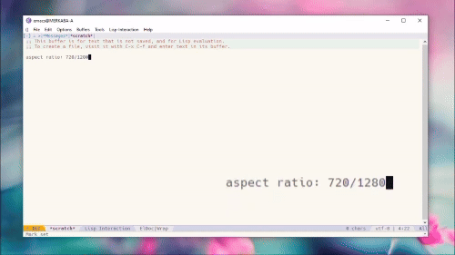

## Enso Launcher (Open-Source)

A feature-rich descendant of Enso Community Edition (Microsoft Windows/Linux/MacOS). 

#### History

At first there was a proprietary closed-source Enso Launcher from [Humanized](https://web.archive.org/web/20140701081042/http://humanized.com/).
Its design was based on radical UI principles developed by Jeff Raskin (more on this below).
This original version was extensible by many programming languages, but one day it went 
open ([Enso Community Edition](https://web.archive.org/web/20110128205130/http://www.ensowiki.com/wiki/index.php?title=Main_Page)) and became extensible only in Python. 
By some reasons it has also ceased.

At the moment [Enso Open-Source](https://gchristensen.github.io/enso-portable/) is the most feature-rich descendant of 
Enso Community Edition. 

#### What is Enso

Enso is a keyboard-driven launcher. It floats over whatever you're doing as a transparent overlay, not in a bulky window of its own.
Tap CapsLock, and a small, unobtrusive command line appears at the top-left of the screen. As you type, it filters through 
a list of short, memorable commands, such as `open notepad`, `google quark`, or `define serendipity`. 
The best matches appear below the input line. You can use the arrow keys to move between them and press Return to run the selected command. 
The interface then disappears.

A handful of built-in commands cover most of what you would otherwise use the mouse for, only faster.
`open` launches applications, documents, and folders by name. You can also teach it new names for the things you open often.
The window commands (`maximize`, `minimize`, `close`, and others) act on the window that has focus. `go` switches to another
open window when you type part of its title. No Alt+Tab required.

Some commands, like `calculate`, work on the currently highlighted text. They can paste the result back in its place.
Media commands (`play`, `pause`, `next track`, `volume up`) control whatever player is running.
Search commands (`google`, `wikipedia`, `youtube`, and others) search for the rest of what you type and open the results in your browser.
Session commands (`shut down`, `reboot`, `log off`, `suspend`, `hibernate`) control the operating system directly. No Start menu ever needed.

Commands are plain Python functions. Anyone who can write one can extend Enso.

It looks like this:

#### New features since Enso Community Edition 

* Python 3 support.
* Option pages with a built-in command editor.
* Ability to disable commands.
* It is possible to execute user-supplied code in a separate thread on Enso start (useful for scheduling).
* Menu constructors (templates for automatic command generation from file-system).
* Ability to restart using tray menu or 'enso restart' command.
* Enso Retreat - a break reminder utility that could be controlled with Enso commands.
* Voice-based command execution.

#### Known issues

* The trigger key will not show the command line if any privileged (adminstrator) process is under the focus (use the 'capslock toggle' command to flip CAPSLOCK state
  if it's wrong). This problem could be mitigated by digitally signing the
  bundled Python binary. Now signing is built into the installer as an installation option.
* Some security tools may consider run-enso.exe as a potentially unwanted program.  
  These are false-positive claims, since the launcher uses API needed to run other programs.

#### Modal vs. quasimodal

The original Enso, in the spirit of Jeff Raskin, was strictly quasimodal. The quasimode (the command line)
stayed open only while you physically held a key, such as CapsLock, and closed the instant it was released.  
A Shift key, for example, works the same way: it capitalizes only while you hold it. This was a deliberate consequence
of Raskin's humane interface philosophy: software modes often lead users to make errors. This happens because the interface
behaves differently depending on invisible state the user must remember. But a mode you must actively sustain by holding a
key can never be forgotten.

Speed was the other half of Raskin's argument. In *The Humane Interface*, he pointed out that using a mouse implies two
steps. First, you visually hunt for a target. Then you guide the pointer onto it. 
This is an action governed by Fitts's Law: the smaller and farther the target, the longer the movement takes.
Moreover, reaching for the mouse also breaks the rhythm a touch typist has built up on the keyboard.
Switching windows is a familiar example of this cost. To click a taskbar entry or an icon buried in another window, you
must first find it on screen.

Typing the name of a command instead skips the hunting and pointing entirely. You recall a word almost instantly. The keystrokes
are the same practiced motions your hands are already making. And because the quasimode matches words as you type, you can
stop as soon as the command is unambiguous.
The original Enso applied this directly: switching windows and acting on selected text are both quasimodal commands there.
Your hands never leave the keyboard by holding the CapsLock key.

For convenience, Enso Open-Source defaults to a modal quasimode. Tap the activation key once, and the
command line opens. It stays open ("sticky") until you run a command or dismiss it, so you don't need to hold CapsLock
down. This default can be reverted to Raskin's original quasimodal behavior by setting the IS_QUASIMODE_MODAL configuration 
variable to False in the textual configuration block at the settings UI.

The speed of the [quasimodal approach](https://youtu.be/o_TlE_U_X3c?t=22) however, does not come naturally to anyone 
used to mainstream computer interaction. You have to train yourself into the habit.

#### Speech Recognition

Enso can listen for your commands and run them without the quasimode. Currently this feature
is available only in Windows and requires the `voicecmd` Enso module to be installed; if it is
missing, the voice controls simply do not appear at the option pages and everything else works as usual.

Spoken commands are prefixed with a keyword, `computer` by default. Saying

    computer open notepad

runs the same command as typing `open notepad` in the quasimode. Only the commands explicitly
enabled for voice at the 'Your Commands' page are listened for. For commands that take an argument,
the available arguments become a part of what can be said, so `open` with its list of applications
lets you say `computer open google chrome` as one phrase.

A command may also be marked as voice-only (spoken, but hidden from the quasimode suggestion list)
or as requiring confirmation - such a command is held back until you answer `yes` or `no`,
which is useful for anything that cannot be undone.

Listening can be suspended and resumed by saying `computer stop listening` and
`computer resume listening`. It also stops by itself while the workstation is locked.

The keyword, the recognizer language, and other voice settings may be changed through the
'Custom Initialization' block at the Enso settings page. See the tutorial at the Enso option
pages for the details.

#### Required dependencies

The Python interpreter used to run Enso Launcher requires the following dependencies:

* pywin32
* flask
 
#### Building platform code

Follow the [platform build instructions](platform/README.win32) and use the makefile 
(compatible with [Mingw](http://www.mingw.org) or [Mingw-w64](https://mingw-w64.org)
mingw32-make) to build and copy binaries to the proper destination. 

#### The original source code

The original source code of **Enso Community Edition** could be found here:
[https://launchpad.net/enso/community-enso](https://launchpad.net/enso/community-enso) (you can download the original source without installing bazaar by using [this](https://bazaar.launchpad.net/%7Ecommunityenso/enso/community-enso/tarball/145?start_revid=145) link).

#### Contributors

* [Brian Peiris](https://github.com/brianpeiris)
* [thdoan](https://github.com/thdoan)
* [Caleb John](https://github.com/CalebJohn)
* [Mark Wiseman](https://github.com/mawiseman)